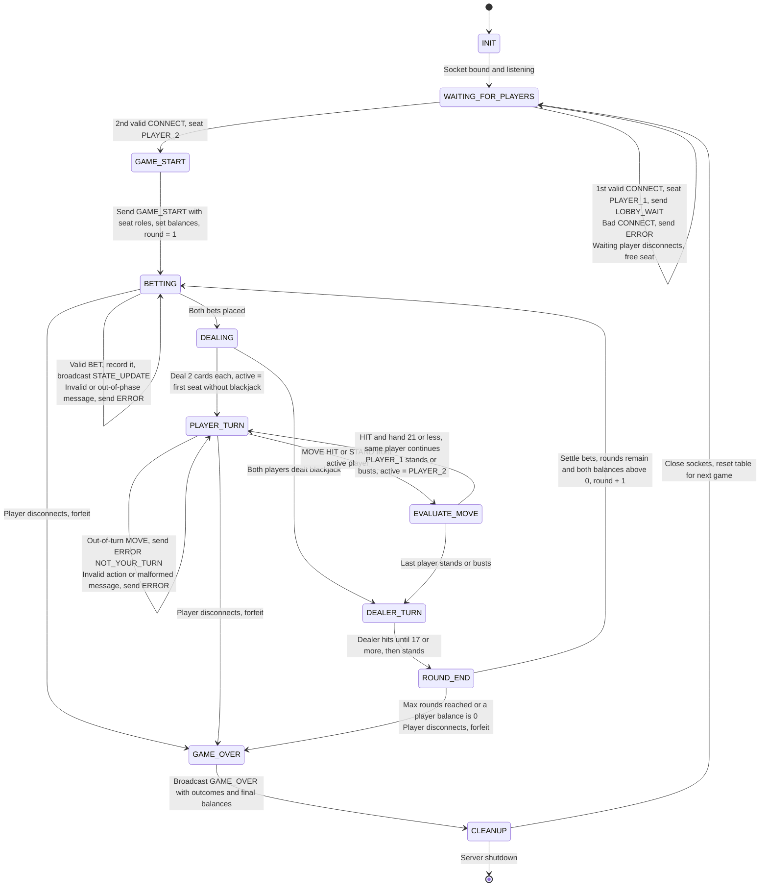

# Game State Machine (FSM) Specification — CS457 Blackjack

**Author:** Christopher Aidan Mills
**Course:** CS 457 — Computer Networks
**Sprint:** 1 — Application Protocol & Game State Machine Design

This document specifies the **server-side** game engine. The server owns all game state and acts as the dealer. Two clients occupy seats `PLAYER_1` and `PLAYER_2`. Message formats are defined in [`protocol_blueprint.md`](protocol_blueprint.md).

---

## 1. State Transition Diagram

---

## 2. State Definitions & Handling Logic

| State | Entry action | Accepted input | On invalid input |
|---|---|---|---|
| `INIT` | Load config (port, `starting_balance`, `max_rounds`, bet limits), bind and listen | none | n/a |
| `WAITING_FOR_PLAYERS` | Clear seats | `CONNECT` | `ERROR` (`NAME_TAKEN`, `MALFORMED_MESSAGE`). Any other type gets `WRONG_PHASE` |
| `GAME_START` | Assign roles: first `CONNECT` is `PLAYER_1`, second is `PLAYER_2`. Send each client `GAME_START` with its own `seat`. Set both balances to `starting_balance` and set `round = 1` | none (transient) | n/a |
| `BETTING` | Clear hands and bets, shuffle a fresh 52-card deck, broadcast `STATE_UPDATE` (`phase:"BETTING"`) | `BET` (once per player) | `ERROR` (`INVALID_BET`, `INSUFFICIENT_FUNDS`, `WRONG_PHASE`) |
| `DEALING` | Deal 2 cards to each player and the dealer (dealer hole card shown as `"??"`). Mark any 21 as `BLACKJACK`. Broadcast `STATE_UPDATE` | none (transient) | n/a |
| `PLAYER_TURN` | Set `active_player` and broadcast `STATE_UPDATE` (`phase:"PLAYER_TURN"`) | `MOVE` from `active_player` only | `ERROR` (`NOT_YOUR_TURN`, `INVALID_ACTION`, `WRONG_PHASE`) |
| `EVALUATE_MOVE` | `HIT`: draw a card and recompute the value (Aces count 11 unless that busts). Over 21 is `BUST`. `STAND`: mark `STAND`. Broadcast `STATE_UPDATE` | none (transient) | n/a |
| `DEALER_TURN` | Reveal the hole card. If at least one player is not `BUST`, hit while the dealer is under 17. Broadcast `STATE_UPDATE` after each card | none (transient) | n/a |
| `ROUND_END` | Settle each player (below), broadcast `STATE_UPDATE` (`phase:"ROUND_END"`, `result` filled in) | none (transient) | n/a |
| `GAME_OVER` | Compute `outcome` per player, broadcast `GAME_OVER` | none (transient) | n/a |
| `CLEANUP` | Close both client sockets (ignore errors), clear buffers, seats, deck and balances | none (transient) | n/a |

**Transient states** (`GAME_START`, `DEALING`, `EVALUATE_MOVE`, `DEALER_TURN`, `ROUND_END`, `GAME_OVER`, `CLEANUP`) run their entry action and immediately take an outgoing transition. They never wait on the network. Any client message that arrives while one of them runs is queued and processed in the next waiting state (`BETTING` or `PLAYER_TURN`).

### 2.1 Turn order & role logic

- `PLAYER_1` always acts before `PLAYER_2` within a round.
- When choosing the next `active_player`, the server skips any seat whose status is `BLACKJACK`. If no seat is left to act, it goes to `DEALER_TURN`.
- A player keeps the turn while they `HIT` and stay at 21 or less. Reaching exactly 21 by hitting auto-stands that player.
- One player busting **does not** end the round. Play moves to the next player, or to the dealer.

### 2.2 Round settlement (`ROUND_END`)

| Player hand | Dealer hand | Result | Balance change |
|---|---|---|---|
| `BUST` | any | `LOSS` | lose bet |
| `BLACKJACK` (2-card 21) | not blackjack | `WIN` | + 1.5 × bet (rounded down) |
| value > dealer, or dealer busts | n/a | `WIN` | + bet |
| value == dealer (neither bust) | n/a | `PUSH` | bet returned |
| value < dealer | n/a | `LOSS` | lose bet |

### 2.3 Game-end conditions (`ROUND_END` → `GAME_OVER`)

- `round == max_rounds` gives `reason:"ROUNDS_COMPLETE"`.
- Any player's balance is `0` gives `reason:"PLAYER_BROKE"`.
- Otherwise `round += 1` and the game returns to `BETTING` (next round).

Per-player `outcome`: `WIN` if `final_balance > starting_balance`, `LOSS` if lower, `DRAW` if equal.

---

## 3. Error Handling & Edge Cases

All of these are handled **without crashing the server loop and without changing state** unless stated otherwise.

| Edge case | Detected in | Server response | Resulting state |
|---|---|---|---|
| Malformed JSON / missing keys / wrong types | any | `ERROR MALFORMED_MESSAGE` to sender | unchanged |
| Unknown `msg_type` | any | `ERROR UNKNOWN_MSG_TYPE` | unchanged |
| Valid message in the wrong state (e.g. `MOVE` during `BETTING`, second `BET`) | any | `ERROR WRONG_PHASE` | unchanged |
| **Out-of-turn move** (`MOVE` from the non-active seat) | `PLAYER_TURN` | `ERROR NOT_YOUR_TURN` | `PLAYER_TURN` (same active player) |
| **Invalid move** (`action` not `HIT`/`STAND`) | `PLAYER_TURN` | `ERROR INVALID_ACTION` | `PLAYER_TURN` |
| Invalid bet (range / funds / type) | `BETTING` | `ERROR INVALID_BET` or `INSUFFICIENT_FUNDS` | `BETTING` |
| Alias taken / 3rd client connects | `WAITING_FOR_PLAYERS` or later | `ERROR NAME_TAKEN` / `LOBBY_FULL` (3rd client's socket closed) | unchanged |
| Oversized frame (> 64 KiB, no `\n`) | any | `ERROR MESSAGE_TOO_LARGE`, close that socket | that seat is treated as `CLIENT_DISCONNECTED` |

### 3.1 Disconnect handling

`DISCONNECT` message, `recv()` EOF (`b""`), `ConnectionResetError`, `ConnectionAbortedError`, `BrokenPipeError` and `TimeoutError` all raise the single internal event **`CLIENT_DISCONNECTED(seat)`** (see `protocol_blueprint.md` §5).

| Current state | Action | Next state |
|---|---|---|
| `WAITING_FOR_PLAYERS` | Free the seat. A later `CONNECT` takes `PLAYER_1` | `WAITING_FOR_PLAYERS` |
| `BETTING`, `PLAYER_TURN`, `ROUND_END` (or queued from a transient state) | The leaving seat forfeits its current bet. Send `GAME_OVER` (`reason:"FORFEIT"`, remaining player `WIN_BY_FORFEIT`) | `GAME_OVER` → `CLEANUP` |
| Both players gone | No one to notify | `CLEANUP` |
| `GAME_OVER` / `CLEANUP` | Ignore (already ending) | unchanged |

### 3.2 Post-game reset

- **Next round:** `ROUND_END → BETTING` keeps both players and balances, and resets hands, bets and the deck.
- **Next game:** `CLEANUP → WAITING_FOR_PLAYERS` closes all sockets and clears every per-game variable, so the server can accept a fresh pair of players without restarting the process.
